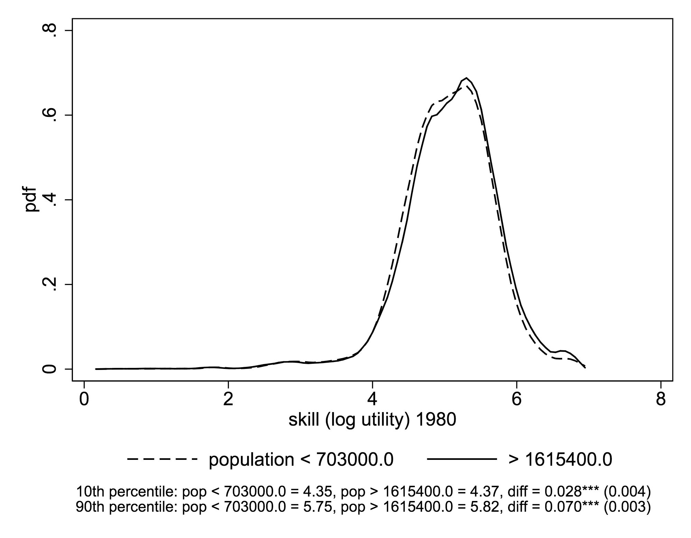

# SSE-project
Analysis of how the covariation of city size and city worker skill distributions has changed from 1970 to 2010 in the US

# Quick Summary

I've successfully replicated figure 5 from the Eeckhout et al paper. Here is their original graph using 2009 ACS data:

And here is the graph I produced using the same data, but with different methodology that can be extended back to previous years. Two things worth noticing on this graph:
1. it is virtually indistinguishable from the original, which is encouraging.
2. the population thresholds for our cutoffs of small and large cities are slightly different. This is because my code has a section that decides what cutoffs to use based on percentiles of the city size distribution. This way, our analysis is consistent across years. I chose the 80th percentile as the cutoff for small cities, and the 93rd percentile as the cutoff for large cities, because these percentiles get us close to the 1M and 2.5M values chosen by the original authors for 2009.

And here are the results using the same methodology on IPUMS Census extracts for 2000, 1990, and 1980:

Overall, it seems like the "fat tails" phenomenon documented by the original authors is a recent development, and really took shape over the course of the 1990s.
